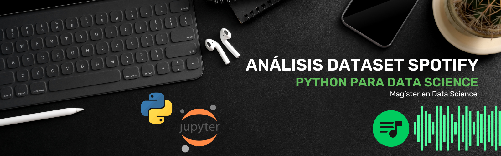

# Repositorio Análisis Dataset Spotify

   
   
   

## Enlace de Dataset

- Top Spotify Songs en 73 países (Daily Updated) [(Dataset Spotify)][kaggle]

[kaggle]: https://www.kaggle.com/datasets/asaniczka/top-spotify-songs-in-73-countries-daily-updated/data